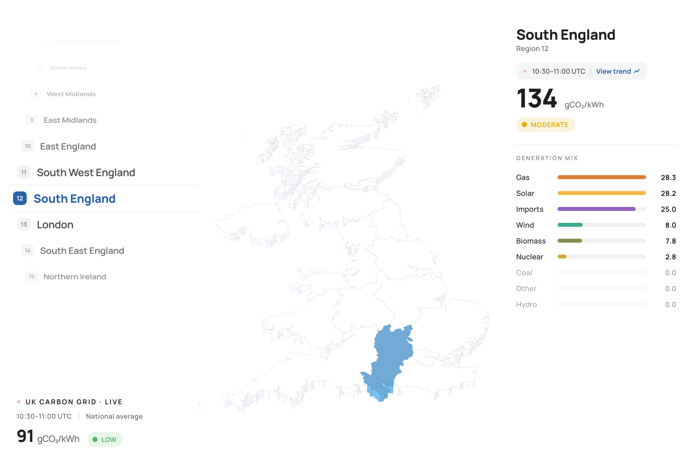
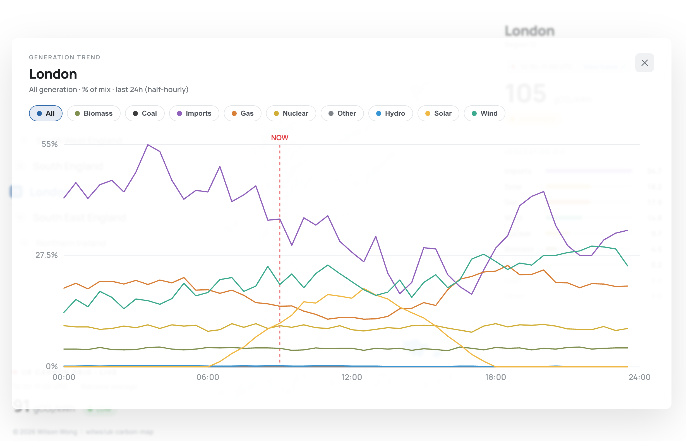

# UK Carbon Map

A live visualisation of the UK electricity grid's carbon intensity, region by region.

Data comes from the [National Grid Carbon Intensity API](https://api.carbonintensity.org.uk/), which reports a forecast carbon intensity (gCO₂/kWh) and a generation mix — wind, solar, nuclear, gas and so on — for each of the 14 DNO regions, updated every half hour.

The project streams that data through Kafka rather than querying the API directly from the browser. That is deliberate overkill for 14 regions: the point is a working event-streaming pipeline you can inspect at every stage, not the shortest path to a map.



Selecting a region opens its generation trend over the last 24 hours, by fuel:



> **Note:** the trend chart is currently generated client-side — a seeded random walk from the region's live reading, not recorded history. Real trends need the Postgres tier described below, which isn't built yet.

## How it works

```
Carbon Intensity API
        │
        ▼
  3 scraper workers          NORTH / MIDLANDS / SOUTH
        │                    one process per zone
        ▼
  Kafka topic                uk-grid-carbon-intensity
  3 partitions               zone → fixed partition
        │
        ▼
  FastAPI gateway            consumes Kafka, broadcasts over WebSocket
        │
        ▼
  React frontend             Three.js map
```

Each worker owns one zone and writes only to that zone's partition:

| Zone | Regions | Partition |
|---|---|---|
| NORTH | 1–5 | 0 |
| MIDLANDS | 6–10 | 1 |
| SOUTH | 11–14 | 2 |

Messages are keyed by region id, so all readings for a given region stay in order.

The gateway holds a single Kafka consumer running as a background task, and fans each message out to every connected browser tab. It reads with `auto.offset.reset: latest`, so a page that connects mid-stream sees only new messages — nothing is replayed from history.

## Structure

```
uk-carbon-map/
├── docker-compose.yml       Kafka, Redis, Postgres, MinIO, Kafka UI
├── backend/
│   ├── workers/             Scrapers — API → Kafka
│   │   ├── scraper.py       One zone per process, selected by WORKER_ZONE
│   │   ├── run-workers.sh   Launches all three zones in parallel
│   │   └── .env             KAFKA_BOOTSTRAP, POLL_SECONDS
│   ├── gateway/             FastAPI — Kafka → WebSocket
│   │   └── main.py
│   └── storage/             Bind-mount targets for container data
│       ├── redis/data
│       ├── postgres/data
│       └── minio/data
└── frontend/                React + Vite + Three.js
    ├── src/components/LiveMap.jsx
    ├── src/hooks/useGridSocket.ts
    └── .env                 VITE_WS_URL
```

`backend/workers` and `backend/gateway` are independent uv projects, each with its own `pyproject.toml` and lockfile.

### The storage tiers — not built yet

Compose brings up Redis, Postgres and MinIO as hot, warm and cold tiers, but **nothing writes to them**. The pipeline currently runs API → Kafka → WebSocket and stops there. Kafka is the only thing holding data, and it's holding it in a container with no volume.

This is the main piece of unfinished work, so it's worth being precise about what's absent.

#### What the gap costs today

The gateway consumes with `auto.offset.reset: latest` and broadcasts each message as it arrives. There is no state anywhere else, which means:

- **A page loaded mid-window shows nothing.** No current snapshot exists to send a new client, so the map waits for the next publish — up to `POLL_SECONDS`. `LiveMap.jsx` papers over this with synthetic data (a hardcoded London reading and a generated mix) until real messages arrive.
- **There is no history.** "How did intensity in the South West move today?" cannot be answered. Every message is forwarded once and forgotten.
- **Nothing survives a restart.** `docker compose down` takes the topic with it.

#### What each tier is for

**Redis — current state.** One key per region holding the latest snapshot, so a connecting client gets the full 14-region picture immediately instead of waiting. This is what removes the synthetic fallback from `LiveMap.jsx`. Small, always-current, overwritten on every message.

**Postgres — queryable history.** One row per region per half-hour window, so intensity over time becomes a query. The natural key is `(region_id, from)`, which makes writes idempotent: the workers republish the same window several times between API updates, and an upsert on that key collapses the duplicates for free.

**MinIO — cold archive.** Raw payloads batched into object storage, partitioned by date. Cheap to keep indefinitely, and the thing you reprocess from if the Postgres schema ever needs to change.

#### What has to be written

A consumer service — call it `backend/sink` — subscribed to the same topic in **its own consumer group**. That detail matters: the gateway is `native-gateway-group`, and a separate group id means both services see every message independently rather than competing for partitions.

Roughly:

```
for each message:
    redis.set(f"region:{region_id}", payload)          # overwrite
    postgres upsert on (region_id, from)               # append
    buffer for periodic flush to MinIO                 # archive
```

Postgres also needs a schema and some migration story, and the gateway needs a change of its own: on WebSocket connect, read the 14 current snapshots from Redis and send them before subscribing the client to the live stream. That's the piece that makes a freshly loaded page correct rather than empty.

None of the credentials are secret — `carbon`/`carbon` for Postgres, `minio`/`minio` for MinIO, both in `docker-compose.yml`. Fine locally, not fine anywhere else.

## Requirements

- Docker Desktop
- [uv](https://docs.astral.sh/uv/) — `brew install uv`
- Node 18+

## Install

Start the infrastructure:

```bash
docker compose up -d
```

Five containers come up. Kafka's host listener is on `localhost:9092`; the other ports are offset to avoid clashing with anything you already run (Postgres 5434, Redis 6381, MinIO 9010/9011, Kafka UI 8080).

Create the topic with three partitions:

```bash
docker exec kafka-cluster kafka-topics --create \
  --bootstrap-server localhost:29092 \
  --topic uk-grid-carbon-intensity \
  --partitions 3 --replication-factor 1
```

This step is not optional. The workers write to fixed partition numbers, so if the topic is auto-created with the default single partition, MIDLANDS and SOUTH fail with `UNKNOWN_PARTITION` while NORTH works — a confusing two-thirds failure. If you hit it, `--alter --partitions 3` fixes an existing topic without losing messages.

Note the port: `29092` is Kafka's internal listener, which is what you use from inside the container. From your host it's `9092`.

Install the Python dependencies:

```bash
cd backend/gateway && uv sync
cd ../workers && uv sync
```

And the frontend:

```bash
cd frontend && npm install
```

## Running

Three processes, three terminals.

**Workers:**

```bash
cd backend/workers
bash run-workers.sh
```

All three zones in parallel, Ctrl-C stops them together. Pass zone names to run a subset — `bash run-workers.sh NORTH`.

**Gateway:**

```bash
cd backend/gateway
uv run uvicorn main:app --reload --port 8001
```

Check it at http://localhost:8001/docs.

**Frontend:**

```bash
cd frontend
npm run dev
```

## Configuration

| File | Variable | Purpose |
|---|---|---|
| `backend/workers/.env` | `KAFKA_BOOTSTRAP` | Broker address, default `localhost:9092` |
| | `POLL_SECONDS` | Seconds between API polls, default 300 |
| `frontend/.env` | `VITE_WS_URL` | Gateway WebSocket, must match the gateway's port |

`scraper.py` reads only `os.environ` — it never calls `load_dotenv()`. The `.env` file is loaded by `run-workers.sh`, which sources and exports it before launching the workers. So running `uv run scraper.py` directly ignores `.env` and falls back to the defaults in the code.

Vite inlines `VITE_WS_URL` at startup, so restart the dev server after changing it. Hot reload won't pick it up.

## Watching it work

Kafka UI at http://localhost:8080 shows messages arriving per partition — the quickest way to confirm the zone-to-partition mapping is behaving.

Two things that make a working pipeline look broken:

**Nothing appears for up to five minutes.** `POLL_SECONDS` defaults to 300 and the gateway doesn't replay history, so a freshly loaded page waits for the next publish. Set `POLL_SECONDS=30` while developing.

**The numbers don't change.** The upstream API updates on half-hour boundaries, so most polls republish an identical window. Messages keep flowing; the values don't move until the half hour turns.

## Known rough edges

- **Kafka has no volume.** `KAFKA_LOG_DIRS` points inside the container at `/tmp`, so topics and cluster metadata vanish whenever the container is recreated — you'll need to recreate the topic. Fine for development, needs a volume before it's anything else.
- **The gateway's broker address is hardcoded** to `localhost:9092` in `main.py`, unlike the workers which read it from the environment. It will need to be configurable before the gateway runs in a container.
- **CORS is wide open** (`allow_origins=["*"]`), appropriate for local development only.
- **The gateway uses `@app.on_event("startup")`**, deprecated in current FastAPI in favour of lifespan handlers. It works, but emits a warning.
